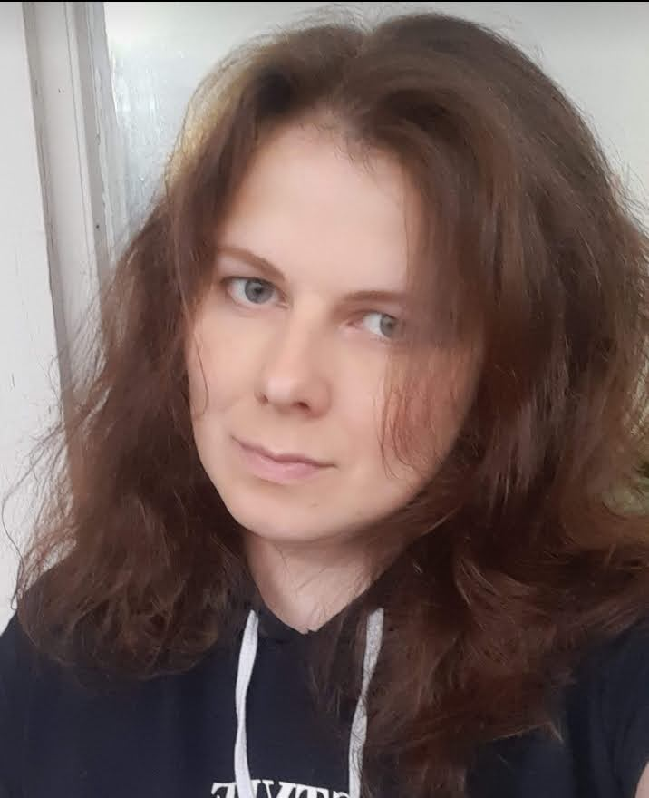

# rsschool-cv
----------
### Elena Kamynina
### Junior Frontend Developer
[](my_photo.jpg)

### Contacts:
- **Discord:** nocch#0698
- **E-mail:** nocchka@gmail.com
- **Tel: +79261474371**
- 
### About myself:
I would like to become a web developer

### Code example:

```javascript
var h1 = document.getElementsByTagName('h1')[0],
    seconds = 0,
    interval10 = 0,
    t;

function add() {
    seconds++;
    if (seconds >= 10) {
        seconds = 0;
        interval10++;
        if (interval10 >= 30) {
            interval10 = 0;
        }
    }

    h1.textContent = (interval10);

    timer();
}

function timer() {
    t = setTimeout(add, 1000);
}
timer();
```

### Language:
Russian - native, English - beginner level

### Work experience:
- **1997-2000:** MEDIA HOLDING Stolichnaya Yarmarka, journalist
- **2000-2012:** freelance, content-manager
- **2012-2014:** Actis-Wunderman, content-manager
- **2014-2015:** Magazine "Automobiles",
- **2015-2019:** OOO "TTL", web-developer student
- **2019-2022:** freelance, general worker

### Education and courses:
self-study
